# 🏗️ Deadman's Switch - Architecture Flow

> **A comprehensive visual guide to the system architecture**

---

## 1. System Overview

```mermaid
graph TB
    subgraph "👤 Users"
        Owner[("🔒 Vault Owner")]
        Recipient[("📩 Recipient")]
    end

    subgraph "🖥️ Frontend - Next.js 14"
        Landing["Landing Page"]
        Dashboard["Dashboard"]
        Create["Create Wizard"]
        Claim["Claim Portal"]
        Demo["Demo Mode"]
    end

    subgraph "🔗 Blockchain - Solana"
        Program["Anchor Program"]
        PDA["Vault PDAs"]
    end

    subgraph "☁️ External Services"
        IPFS["IPFS / Pinata"]
        Email["Resend API"]
        Cron["Vercel Cron"]
    end

    Owner --> Landing
    Owner --> Dashboard
    Owner --> Create
    Recipient --> Claim
    
    Create --> IPFS
    Create --> Program
    Dashboard --> Program
    Claim --> Program
    Claim --> IPFS
    
    Program --> PDA
    Cron --> Program
    Cron --> Email
    Email --> Recipient
```

---

## 2. Component Architecture

```mermaid
graph TB
    subgraph "📱 src/app/ - Pages"
        A1["/ - Landing"]
        A2["/create - Vault Creation Wizard"]
        A3["/dashboard - Owner Dashboard"]
        A4["/claim - Recipient Claim Portal"]
        A5["/demo - Interactive Demo"]
        A6["/archive - Released Vaults"]
    end

    subgraph "🧩 src/components/"
        subgraph "Wizard Flow"
            W1["TemplateSelector"]
            W2["StepRecipient"]
            W3["StepContent"]
            W4["StepUploadSecret"]
            W5["StepReview"]
        end
        
        subgraph "Dashboard"
            D1["VaultGrid"]
            D2["VaultCard"]
            D3["CheckInButton"]
            D4["VaultDetailsModal"]
        end
        
        subgraph "Claim"
            C1["ClaimForm"]
            C2["ClaimModal"]
            C3["VaultReveal"]
            C4["Safe3D Animation"]
        end
        
        subgraph "Kip Mascot"
            K1["KipSpirit"]
            K2["KipChat"]
        end
    end

    A2 --> W1 --> W2 --> W3 --> W4 --> W5
    A3 --> D1 --> D2
    D2 --> D3
    D2 --> D4
    A4 --> C1 --> C2 --> C3
    C3 --> C4
    A3 --> K1
```

---

## 3. Smart Contract Architecture

### Vault Account Structure

---

## 4. Data Flow: Create Vault

---

## 5. Data Flow: Check-In (Ping)

```mermaid
sequenceDiagram
    participant O as Owner
    participant UI as Dashboard
    participant S as Solana Program

    O->>UI: 1. Hold Check-In Button
    UI->>S: 2. ping() instruction
    S->>S: 3. Update last_check_in = now()
    S-->>UI: 4. Success
    UI->>UI: 5. Show "Alive" animation 💚
```

---

## 6. Data Flow: Trigger & Claim

```mermaid
sequenceDiagram
    participant Cron as Vercel Cron
    participant S as Solana Program
    participant E as Resend Email
    participant R as Recipient
    participant UI as Claim Portal
    participant IPFS as Pinata/IPFS
    participant C as Crypto Utils

    Note over Cron: Every 5 minutes
    Cron->>S: 1. Fetch all Vault accounts
    S-->>Cron: 2. Return vaults
    
    Cron->>Cron: 3. Check: now > last_check_in + interval?
    
    alt Vault Expired
        Cron->>S: 4. trigger_release()
        S->>S: 5. Set is_released = true
        Cron->>E: 6. Send claim email
        E->>R: 7. "Your vault is ready"
    end
    
    R->>UI: 8. Connect Wallet / Enter Password
    UI->>S: 9. Verify is_released && recipient matches
    S-->>UI: 10. Return CID + Encrypted Key
    
    UI->>IPFS: 11. Fetch encrypted blob
    IPFS-->>UI: 12. Encrypted content
    
    UI->>C: 13. Decrypt key (wallet sig / password)
    C->>C: 14. Decrypt content with AES key
    C-->>UI: 15. Decrypted content
    
    UI->>R: 16. Show revealed content 🎉
```

---

## 7. Encryption Model

---

## 8. API Routes Structure

```mermaid
graph TB
    subgraph "🔌 src/app/api/"
        subgraph "Vault Operations"
            V1["POST /vault/create"]
            V2["POST /vault/update"]
            V3["DELETE /vault/close"]
            V4["POST /vault/claim"]
        end
        
        subgraph "Check-In"
            P1["POST /magic-ping - Email link ping"]
        end
        
        subgraph "Cron Jobs"
            C1["GET /cron/check-status"]
        end
        
        subgraph "Notifications"
            A1["POST /alert - Send emails"]
        end
        
        subgraph "AI Features"
            AI1["POST /ai/smart-timer"]
            AI2["POST /ai/antidoxx"]
        end
        
        subgraph "System"
            S1["GET /system/health"]
        end
    end
```

---

## 9. Utility Modules

```mermaid
graph LR
    subgraph "🛠️ src/utils/"
        U1["anchor.ts - Solana connection & program"]
        U2["crypto.ts - AES encryption/decryption"]
        U3["ipfs.ts - Pinata upload/download"]
        U4["email.ts - Resend templates"]
        U5["kip.ts - Mascot state logic"]
        U6["safetyScanner.ts - Anti-doxx regex"]
        U7["vaultBundle.ts - Multi-media zip handler"]
        U8["solanaParsers.ts - Account parsing"]
    end
```

---

## 10. Tech Stack Summary

| Layer | Technology | Purpose |
|-------|------------|---------|
| **Frontend** | Next.js 14 (App Router) | React SSR, API Routes |
| **Styling** | Tailwind CSS + Framer Motion | UI & Animations |
| **Blockchain** | Solana (Devnet) | Trust Layer |
| **Smart Contract** | Rust + Anchor | Vault Logic |
| **Storage** | IPFS via Pinata | Encrypted Content |
| **Email** | Resend API | Notifications |
| **Cron** | Vercel Cron | Status Checks |
| **Database** | Supabase | User preferences (optional) |

---

## 11. Security Architecture

```mermaid
flowchart TB
    subgraph "🛡️ Security Layers"
        L1["1. Client-Side Encryption"]
        L2["2. Zero-Knowledge Design"]
        L3["3. PDA Ownership Constraints"]
        L4["4. Time-Based Triggers"]
        L5["5. Permissionless Release"]
    end
    
    L1 --> |AES-256-GCM| S1["Keys never leave browser"]
    L2 --> |Server blind| S2["Server sees only encrypted blobs"]
    L3 --> |Anchor constraints| S3["Only owner can ping/update"]
    L4 --> |On-chain clock| S4["Trustless expiration"]
    L5 --> |Anyone can trigger| S5["No single point of failure"]
```

---

## 12. Deployment Architecture

---

> **Last Updated:** 2025-12-11
